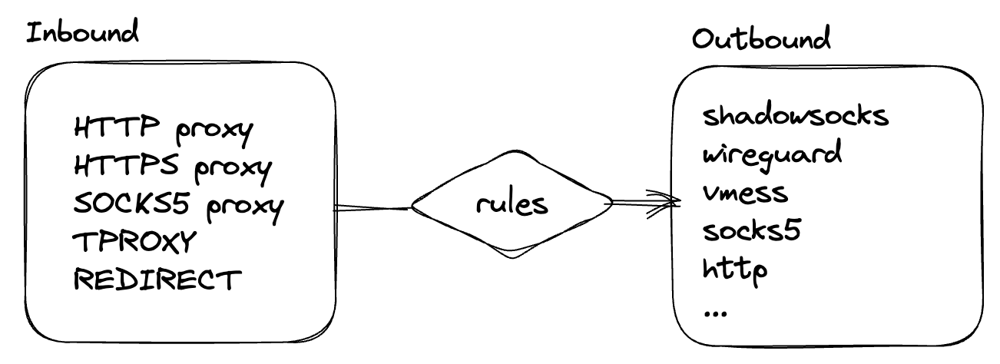

<h1 align="center">
  <br>routune<br>
</h1>

[](https://github.com/eyslce/routune/actions/workflows/codeql.yml)


routune 是一款使用 Go 语言编写的基于规则的网络隧道工具（Rule-based network tunnel）。它可以作为你网络网关的核心组件，帮助你灵活地管理和路由网络流量。

## 项目架构

routune 的核心工作流程可以概括为：**入站连接 -> 规则匹配 -> 出站派发**。



主要组件包括：

*   **入站处理器 (Inbound Listerners)**: 负责监听本地端口，接收来自客户端的连接请求。支持多种入站协议，如 HTTP(S), SOCKS5, Shadowsocks, Redir (透明代理), TProxy, Mixed (混合端口)。可以配置入站认证和局域网访问控制。
*   **规则引擎 (Rules Engine)**: 这是 routune 的核心。它根据用户定义的规则（支持域名、IP CIDR、GeoIP、进程名等多种匹配条件）对每一条入站连接进行判定，决定该连接应该通过哪个出站策略进行转发。
*   **出站处理器 (Outbound Proxies & Proxy Groups)**: 
    *   **代理 (Proxies)**: 定义了具体的远程代理服务器信息，支持 Shadowsocks, Vmess, Trojan, SOCKS5, HTTP(S) 等多种协议，并可配置各类插件 (如 obfs, v2ray-plugin) 和传输方式 (如 WebSocket, HTTP/2)。
    *   **策略组 (Proxy Groups)**: 允许将多个代理或策略组组合起来，实现更灵活的路由控制。常见的策略组类型包括：
        *   `select`: 手动选择一个子策略。
        *   `url-test`: 自动测试子策略的延迟并选择最优者。
        *   `fallback`: 按顺序测试子策略的可用性，并选择第一个可用的。
        *   `load-balance`: 在多个子策略间实现负载均衡。
*   **DNS 解析器 (DNS Resolver)**: 内建 DNS 服务器，支持自定义上游 DNS (UDP, TCP, DoT, DoH, DHCP)，Fake-IP 模式（用于优化 NAT 性能并避免 DNS 泄露），自定义 Hosts，以及基于规则的 DNS 策略和 Fallback 机制，有效对抗 DNS 污染。
*   **外部控制器 (External Controller)**: 提供 RESTful API 接口，允许第三方应用或脚本查询状态、更改配置、动态切换策略组选择等。
*   **配置文件管理器 (Configuration Manager)**: routune 通过 YAML 格式的配置文件进行驱动，支持配置热重载。

## 核心特性

*   **灵活的入站代理**: 支持 HTTP(S), SOCKS5, Shadowsocks (服务端模式), Redir (透明代理TCP), TProxy (透明代理TCP/UDP), Mixed (混合端口) 等多种入站方式。
*   **强大的基于规则的路由**: 
    *   支持多种匹配类型：`DOMAIN-SUFFIX`, `DOMAIN-KEYWORD`, `DOMAIN`, `IP-CIDR`, `SRC-IP-CIDR`, `GEOIP`, `DST-PORT`, `SRC-PORT`, `PROCESS-NAME`, `MATCH` (兜底规则) 等。
    *   规则可以指向具体的代理服务器或策略组。
    *   支持 `no-resolve` 选项，避免对特定域名进行 DNS 解析后匹配 IP 规则。
*   **丰富的出站协议支持**: 
    *   Shadowsocks (SS) 及各类加密方式、插件 (obfs, v2ray-plugin)。
    *   VMess (V2Ray) 及各类加密、传输方式 (WebSocket, HTTP/2, QUIC - 取决于版本)。
    *   Trojan。
    *   SOCKS5。
    *   HTTP(S)。
    *   Snell。
    *   (更多协议请参考最新文档)
*   **智能策略组**: 
    *   `select`: 手动选择节点。
    *   `url-test`: 自动选择延迟最低的节点。
    *   `fallback`: 在节点故障时自动切换到备用节点。
    *   `load-balance`: 实现流量的负载均衡。
*   **增强型 DNS 处理**: 
    *   内建 DNS 服务器，可作为系统或局域网 DNS。
    *   支持 `fake-ip` 和 `redir-host` 模式以优化性能和兼容性。
    *   自定义上游 DNS (UDP, TCP, DoH, DoT, 从 DHCP 获取)。
    *   DNS Fallback 机制及基于 GeoIP 和 IP CIDR 的过滤，有效应对 DNS 污染。
    *   自定义 Hosts 记录 (支持通配符)。
    *   特定域名的 DNS 策略路由。
*   **透明代理**: 支持 Linux 上的 Redir 和 TProxy，可实现网关级别的透明代理。
*   **配置文件热重载**: 无需重启即可应用新的配置。
*   **外部控制与 API**: 通过 RESTful API 进行状态监控、配置修改和策略切换，并支持外部 UI 面板。
*   **GeoIP 数据库支持**: 可根据 IP 地理位置信息进行路由决策。
*   **用户认证**: 支持对 SOCKS5/HTTP(S) 入站代理设置用户认证。
*   **Profile 管理**: 可选择性地持久化策略组的手动选择结果和 Fake-IP 映射。
*   **跨平台**: 使用 Go 语言编写，可编译运行于多种操作系统和架构。

## 构建

确保你已经安装了 Go (推荐最新稳定版本)。

```bash
# 克隆仓库
# git clone https://github.com/eyslce/routune.git
# cd routune

# 构建
make # 或者直接使用 go build
```

构建成功后，可执行文件将位于当前目录（使用 `go build`）或 `release` 目录（根据 `Makefile` 定义可能有所不同）。

## 配置

routune 启动时需要一个 YAML 格式的配置文件。默认情况下，它会尝试加载位于 `~/.config/routune/config.yaml` (Linux/macOS) 或 `config.yaml` (与可执行文件同目录，或通过 `-d` 参数指定的目录) 的配置文件。

你可以通过 `-f <your_config_file_path>` 参数指定自定义的配置文件路径。

详细的配置参数说明和示例，请参考项目 `docs` 目录下的文档，特别是 `configuration-reference.md`。

## 使用

启动 routune：

```bash
./routune -f /path/to/your/config.yaml
```

测试配置文件是否有效：

```bash
./routune -t -f /path/to/your/config.yaml
```

查看版本信息：
```bash
./routune -v
```

更多命令行参数，请使用 `./routune -h` 查看帮助。

## 贡献

欢迎各种形式的贡献！无论是提交 Issue、发起 Pull Request，还是改进文档，都对项目非常有帮助。

在提交代码前，请确保你的代码符合项目的编码规范，并通过相关的 Linter 和测试检查。

## 许可证

本项目采用 [GNU General Public License v3.0 (GPLv3)](LICENSE) 授权。
